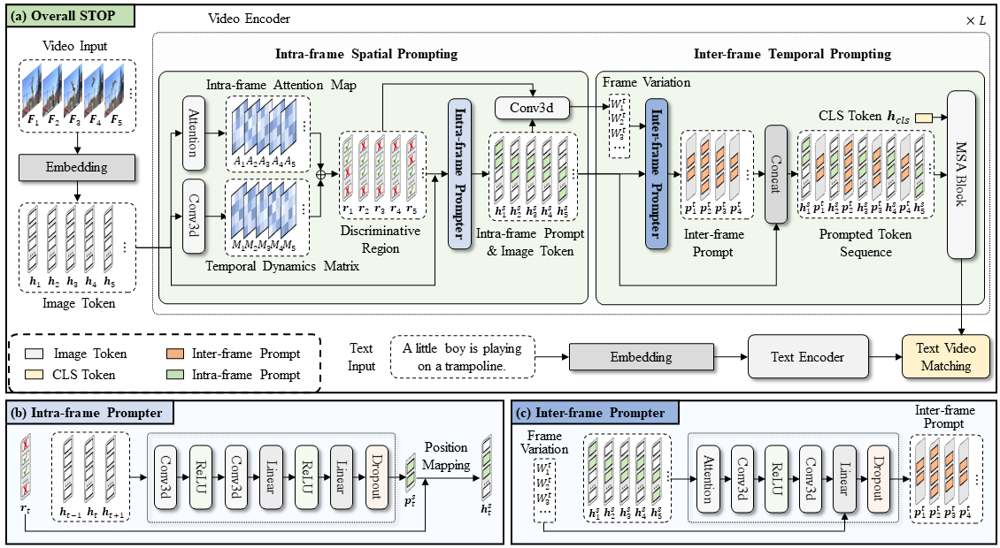

<<<<<<< HEAD
# [CVPR2025] STOP: Integrated Spatial-Temporal Dynamic Prompting for Video Understanding

<div align="center">

<div>
      Zichen Liu<sup>1</sup>&emsp; Kunlun Xu<sup>1</sup>&emsp; Bing Su<sup>2</sup>&emsp; Xu Zou<sup>3</sup>&emsp; Yuxin Peng<sup>1</sup>&emsp; Jiahuan Zhou<sup>1 *</sup>
  </div>
<div>

  <sup>1</sup>Wangxuan Institute of Computer Technology, Peking University&emsp;
  <sup>2</sup>Gaoling School of Artificial Intelligence, Renmin University of China&emsp;
  <sup>3</sup>School of Artificial Intelligence and Automation, Huazhong University of Science and Technology&emsp;

</div>
</div>
<p align="center">
  <a href='https://arxiv.org/pdf/2503.15973'></a>
  <a href="https://github.com/zhoujiahuan1991/CVPR2025-STOP"></a>
</p>


<!-- <div align="center">
  
# 【AAAI'2024 🔥】DGL: Dynamic Global-Local Prompt Tuning for Text-Video Retrieval
[](https://ojs.aaai.org/index.php/AAAI/article/view/28475)
[](https://arxiv.org/pdf/2401.10588v1)
</div> -->

The *official* repository for  [STOP: Integrated Spatial-Temporal Dynamic Prompting for Video Understanding](https://arxiv.org/pdf/2503.15973).





### Environment 
This code is based on pytorch2.4.0, pytorch-cuda11.8, and torchvision 0.19.0.

For a complete configuration environment, see environment.yaml


### Download CLIP Model
Download CLIP pre-trained weights and place them in `${HOME}/models/pretrained`. Then, you need to modify the `pretrained_dir` in the shell file to the path where you stored the models.

```
wget https://openaipublic.azureedge.net/clip/models/40d365715913c9da98579312b702a82c18be219cc2a73407c4526f58eba950af/ViT-B-32.pt
```

### Download Datasets

MSR-VTT
Download the splits and captions from CLIP4clip:
```
wget https://github.com/ArrowLuo/CLIP4Clip/releases/download/v0.0/msrvtt_data.zip
```
Download the videos from Frozen️-in-Time:
```
wget https://www.robots.ox.ac.uk/~maxbain/frozen-in-time/data/MSRVTT.zip
```


### Prepare data

Video preprocessing can be done by [preprocess/compress_video.py](preprocess/compress_video.py).
```
python preprocess/compress_video.py --input_root [raw_video_path] --output_root [compressed_video_path]
```
This script will compress the video to *3fps* with width *224* (or height *224*). Modify the variables for your customization.


### STOP
Taking the MSRVTT dataset as an example, you can run the following command:
```
chmod +x ./scripts/msrvtt.sh
bash ./scripts/msrvtt.sh
```


### Results

 Comparison with state-of-the-art on the MSR-VTT dataset. For a fair comparison,all methods use CLIP-ViT-B/32 as the backbone. “Params” represents the number of trainable parameters of each method. The best and second best results are marked in RED and BLUE, respectively.


### Citation
If you find this code useful for your research, please cite our paper.
```
@article{liu2025stop,
  title={STOP: Integrated Spatial-Temporal Dynamic Prompting for Video Understanding},
  author={Liu, Zichen and Xu, Kunlun and Su, Bing and Zou, Xu and Peng, Yuxin and Zhou, Jiahuan},
  journal={arXiv preprint arXiv:2503.15973},
  year={2025}
}
```


### Acknowledgement
Our code is based on the [DGL](https://github.com/knightyxp/DGL) and [CLIP4clip](https://github.com/ArrowLuo/CLIP4Clip). Thanks for their impressive works!

### Contact
For any questions, feel free to contact us ([lzc20180720@stu.pku.edu.cn](lzc20180720@stu.pku.edu.cn)).

Welcome to our Laboratory Homepage ([OV<sup>3</sup> Lab](https://zhoujiahuan1991.github.io/)) for more information about our papers, source codes, and datasets.
=======
# [CVPR2025] STOP: Integrated Spatial-Temporal Dynamic Prompting for Video Understanding

<div align="center">

<div>
      Zichen Liu<sup>1</sup>&emsp; Kunlun Xu<sup>1</sup>&emsp; Bing Su<sup>2</sup>&emsp; Xu Zou<sup>3</sup>&emsp; Yuxin Peng<sup>1</sup>&emsp; Jiahuan Zhou<sup>1 *</sup>
  </div>
<div>

  <sup>1</sup>Wangxuan Institute of Computer Technology, Peking University&emsp;
  <sup>2</sup>Gaoling School of Artificial Intelligence, Renmin University of China&emsp;
  <sup>3</sup>School of Artificial Intelligence and Automation, Huazhong University of Science and Technology&emsp;

</div>
</div>
<p align="center">
  <a href='https://arxiv.org/pdf/2503.15973'></a>
  <!-- <a href="https://hits.seeyoufarm.com"></a> -->
</p>


<!-- <div align="center">
  
# 【AAAI'2024 🔥】DGL: Dynamic Global-Local Prompt Tuning for Text-Video Retrieval
[](https://ojs.aaai.org/index.php/AAAI/article/view/28475)
[](https://arxiv.org/pdf/2401.10588v1)
</div> -->

The *official* repository for  [STOP: Integrated Spatial-Temporal Dynamic Prompting for Video Understanding](https://arxiv.org/pdf/2503.15973).


### Environment 
This code is based on pytorch2.4.0, pytorch-cuda11.8, and torchvision 0.19.0.

For a complete configuration environment, see environment.yaml


### Download CLIP Model
Download CLIP pre-trained weights and place them in `${HOME}/models/pretrained`. Then, you need to modify the `pretrained_dir` in the shell file to the path where you stored the models.

```
wget https://openaipublic.azureedge.net/clip/models/40d365715913c9da98579312b702a82c18be219cc2a73407c4526f58eba950af/ViT-B-32.pt
```

### Download Datasets

MSR-VTT
Download the splits and captions from CLIP4clip:
```
wget https://github.com/ArrowLuo/CLIP4Clip/releases/download/v0.0/msrvtt_data.zip
```
Download the videos from Frozen️-in-Time:
```
wget https://www.robots.ox.ac.uk/~maxbain/frozen-in-time/data/MSRVTT.zip
```


### Prepare data

Video preprocessing can be done by [preprocess/compress_video.py](preprocess/compress_video.py).
```
python preprocess/compress_video.py --input_root [raw_video_path] --output_root [compressed_video_path]
```
This script will compress the video to *3fps* with width *224* (or height *224*). Modify the variables for your customization.


### STOP
Taking the MSRVTT dataset as an example, you can run the following command:
```
chmod +x ./scripts/msrvtt.sh
bash ./scripts/msrvtt.sh
```


### Results

 Comparison with state-of-the-art on the MSR-VTT dataset. For a fair comparison,all methods use CLIP-ViT-B/32 as the backbone. “Params” represents the number of trainable parameters of each method. The best and second best results are marked in RED and BLUE, respectively.


### Citation
If you find this code useful for your research, please cite our paper.
```
@article{liu2025stop,
  title={STOP: Integrated Spatial-Temporal Dynamic Prompting for Video Understanding},
  author={Liu, Zichen and Xu, Kunlun and Su, Bing and Zou, Xu and Peng, Yuxin and Zhou, Jiahuan},
  journal={arXiv preprint arXiv:2503.15973},
  year={2025}
}
```


### Acknowledgement
Our code is based on the [DGL](https://github.com/knightyxp/DGL) and [CLIP4clip](https://github.com/ArrowLuo/CLIP4Clip). Thanks for their impressive works!

### Contact
For any questions, feel free to contact us ([lzc20180720@stu.pku.edu.cn](lzc20180720@stu.pku.edu.cn)).

Welcome to our Laboratory Homepage ([OV<sup>3</sup> Lab](https://zhoujiahuan1991.github.io/)) for more information about our papers, source codes, and datasets.
>>>>>>> 823cf50 (update readme)
